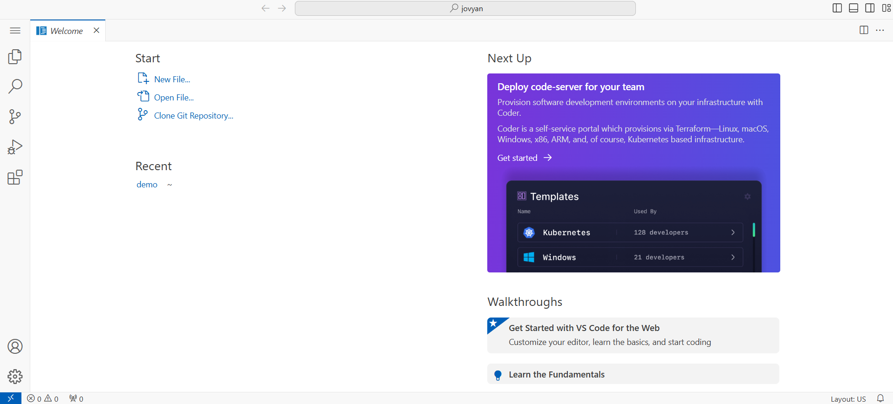

# Step 0 — Set up your Vayu Workspace

**Step 0 of 6** · [🏠 Overview](../README.md) · [Step 1 — Object Storage →](../01_dataset/)

> **Goal:** Create a place in the cloud (a "workspace") where you'll run the notebooks and the chat app for the rest of this project.

**What you'll do here:**
1. Create a Vayu AI Studio workspace (with Docker enabled)
2. Clone this `ask-it` repository into it
3. Install the Python dependencies
4. Pick the right kernel for the notebooks

You only do this step once.

> 💡 **Tip:** Each section below is collapsed. Click a heading to expand its details.

---

<details>
<summary><strong>🧭 What is a "workspace"?</strong></summary>

<br>

A **Vayu AI Studio workspace** is a ready-to-use cloud computer with a terminal, a code editor, and Jupyter notebooks. Instead of setting up Python on your own laptop, you do everything inside this workspace.



</details>

<details>
<summary><strong>1️⃣ Create the workspace</strong></summary>

<br>

> **Already have a workspace?** If one was provided to you, skip straight to the next section.

1. Log in to [Vayu AI Studio → Workspaces](https://ipcloud.tatacommunications.com/aistudio/#/build/workspace-list).
2. Click **Create Workspace** and follow the wizard (Start → Infrastructure → Configure Compute and Storage → Observability → Review). The [Creating Workspace guide](https://ipcloud.tatacommunications.com/docs/docs/user-docs/vayu-ai-studio/workspace/#creating-workspace) walks through each screen.
3. **Add an object storage host alias:** during creation, add a **host alias** using the **IP** and **endpoint** from your SOP document. Enter the endpoint as the hostname **only** — no `http://` or `https://`.
4. **Turn on "Enable Docker in the Workspace"** before you finish. This is required later for [Step 5](../05_build_app/) and [Step 6](../06_deploy/).

</details>

<details>
<summary><strong>2️⃣ Get the code into your workspace</strong></summary>

<br>

Open the workspace terminal and clone this repository:

```bash
git clone https://ailab.cloudservices.tatacommunications.com/code/vayu-hackathon/ask-it.git
```

(Or upload the folder manually through the UI.)

</details>

<details>
<summary><strong>3️⃣ Install dependencies</strong></summary>

<br>

Still in the terminal, set up a Python virtual environment and install the packages:

```bash
python3 -m venv .venv
source .venv/bin/activate
cd ask-it
pip install -r requirements.txt

cp .env.example .env
# You'll fill in .env with credentials as you complete Steps 2–3 (and Step 6)
```

> A **virtual environment** (`.venv`) keeps this project's packages separate from everything else. The `source .venv/bin/activate` line "turns it on" — you'll run it each time you open a new terminal.

</details>

<details>
<summary><strong>4️⃣ Select the notebook kernel</strong></summary>

<br>

Whenever you open a notebook (`.ipynb`) in this project, tell it to use the `.venv` you just created:

1. Open **Select Kernel** and choose **Python Environments**.

   

2. Pick the **Recommended** environment (it should point to your new `.venv`).

   

3. **Double-check the path:** the selected interpreter should end with `<your-env-name>/bin/python` — for example, `.venv/bin/python`.

</details>

<details>
<summary><strong>✅ You're done when</strong></summary>

<br>

- Your workspace opens and the terminal works.
- `pip install -r requirements.txt` finished without errors.
- A `.env` file exists in `ask-it/` (you'll fill it in later).

</details>

<details>
<summary><strong>🔗 Where you'll work next & resources</strong></summary>

<br>

You'll use this workspace for:

- [Step 1 — Vayu Object Storage](../01_dataset/) (upload your documents)
- [Step 4 — RAG ingest notebook](../04_starter_kit/qna.ipynb)
- [Step 5 — Chat app & deploy](../05_build_app/)

| Resource | Link |
|----------|------|
| Vayu AI Studio | [Workspace Dashboard](https://ipcloud.tatacommunications.com/aistudio/#/build/workspace-list) |
| Documentation | [Workspace documentation](https://ipcloud.tatacommunications.com/docs/docs/user-docs/vayu-ai-studio/workspace/) |

</details>

---

<p align="center"><a href="../README.md">🏠 Ask-It overview</a></p>

<table width="100%">
<tr>
<td align="left"></td>
<td align="right"><a href="../01_dataset/">Step 1 — Vayu Object Storage →</a></td>
</tr>
</table>
