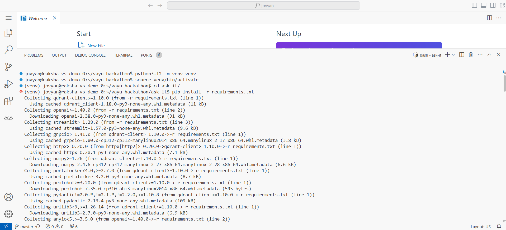
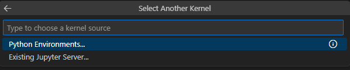
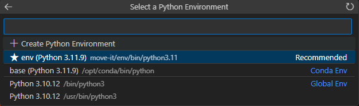

# 🧪 Step 4 — Index your documents (RAG ingest lab)

**Ask-It** › **Vayu AI Studio (RAG lab)** · `04_starter_kit/`

> **Goal:** Run one notebook (`qna.ipynb`) that reads your documents, turns them into embeddings, and stores them in your Vector DB — so the chat app has something to search.

**What you'll do here:**
1. Confirm Steps 0–3 are done and `.env` is filled in
2. Open `qna.ipynb` and select the kernel
3. Run all cells and watch it index + answer a test question

> **This step is required before the chat app will work.** The app in Step 5 only *searches* — this notebook is what actually fills the database.

<table width="100%" style="width:100%">
<tr>
<td align="left"><a href="../03_vayu_model_as_a_service/README.md">Previous — Step 3 — Model as a Service</a></td>
<td align="right"><a href="../05_build_app/README.md">Next — Step 5 — Chat app</a></td>
</tr>
</table>

---

<details>
<summary><h3>📁 What's in this folder</h3></summary>

| File | What it does |
|------|--------------|
| `qna.ipynb` | Chunks your documents, embeds them via MaaS, stores them in the Vector DB, and runs a test question with citations |

</details>

---

<details>
<summary><h3>📋 Before you start</h3></summary>

Make sure these earlier steps are complete:

| Step | What you need from it |
|------|-----------------------|
| [0](../00_vayu_workspace/) | A workspace with the repo cloned and `.venv` created |
| [1](../01_dataset/) | Your documents in `docs/` |
| [2](../02_vayu_vector_databases/) | `QDRANT_URL`, `QDRANT_API_KEY` in `.env` |
| [3](../03_vayu_model_as_a_service/) | API keys, base URL, and model IDs in `.env` |

If you haven't installed dependencies yet:



```bash
python3 -m venv .venv
source .venv/bin/activate
cd ask-it
pip install -r requirements.txt

cp .env.example .env
# Fill in credentials from Steps 2–3
```

**Required in `ask-it/.env`** (the notebook stops early with a clear error if any are missing):
`QDRANT_URL`, `QDRANT_API_KEY`, `LLM_OPENAI_API_KEY`, `EMBEDDING_OPENAI_API_KEY`, `OPENAI_BASE_URL`, `COLLECTION_NAME`.

</details>

---

<details>
<summary><h3>1. Open the notebook and pick the kernel</h3></summary>

Open `04_starter_kit/qna.ipynb`, then:

1. Open **Select Kernel** → **Python Environments**.

   

2. Pick the **Recommended** environment (it should point to the `.venv` from [Step 0](../00_vayu_workspace/)).

   

3. Confirm the interpreter path ends with `<your-env-name>/bin/python` (e.g. `.venv/bin/python`).

</details>

---

<details>
<summary><h3>2. Run all cells</h3></summary>

Run every cell top to bottom. The notebook will chunk your documents, embed them, store them in the Vector DB, and finish by calling `rag_answer()` on a sample question — with citations.

</details>

---

<details>
<summary><h3>3. Continue</h3></summary>

Once it runs cleanly, go to [Step 5](../05_build_app/) to chat with your data locally.

</details>

---

<details>
<summary><h3>⚙️ What does <code>qna.ipynb</code> actually do?</h3></summary>

| Stage | What happens |
|-------|--------------|
| **Connect** | Sets up the **Vector DB** (Qdrant) and **MaaS** clients |
| **Probe** | Checks the embedding size to auto-configure the collection |
| **Index** | Chunks the docs in `DOCS_DIR`, embeds them, and stores them in `COLLECTION_NAME` |
| **Test** | Runs `rag_answer()` to prove retrieval + answering works |

Choose which documents to index near the bottom of the notebook:

```python
DOCS_DIR = Path("../01_dataset/docs")
```

</details>

---

<details>
<summary><h3>🔧 Two settings you may need to change</h3></summary>

Both are in **cell 6** of `qna.ipynb`:

- **Using the hosted Vector DB?** Comment out `qdrant = local_db()` and uncomment `qdrant = hosted_instance()`. (`local_db()` is for on-disk Qdrant only.)
- **Rebuilding the index from scratch?** Uncomment `ensure_collection(qdrant, recreate=True)` before running **cell 7** (`upsert_chunks(chunks)`). This wipes old vectors first.

</details>

---

<details>
<summary><h3>🧩 The key functions</h3></summary>

| Function | Purpose |
|----------|---------|
| `load_chunks_from_docs` | Read files and split them into chunks |
| `embed_texts` | Create embeddings via Vayu Model as a Service |
| `upsert_chunks` | Store vectors in the Vayu Vector DB |
| `retrieve` & `rag_answer` | Search, then generate an answer with sources |

</details>

---

<details>
<summary><h3>🚀 What happens after ingest?</h3></summary>

With the `.venv` still active and env vars from Steps 2–3 set, you can jump straight into the app:

```bash
cd 05_build_app
streamlit run chat_app.py
```

Use the **same** `.env` values you used here.

</details>

---

<details>
<summary><h3>💡 Pro tips</h3></summary>

- Use the same embedding and chat models as [Step 3](../03_vayu_model_as_a_service/).
- If you change the embedding model, **recreate** the Vector DB collection — the vector size must match.

</details>

---

<table width="100%" style="width:100%">
<tr>
<td align="left"><a href="../03_vayu_model_as_a_service/README.md">Previous — Step 3 — Model as a Service</a></td>
<td align="center"><a href="../README.md">Overview</a></td>
<td align="right"><a href="../05_build_app/README.md">Next — Step 5 — Chat app</a></td>
</tr>
</table>
