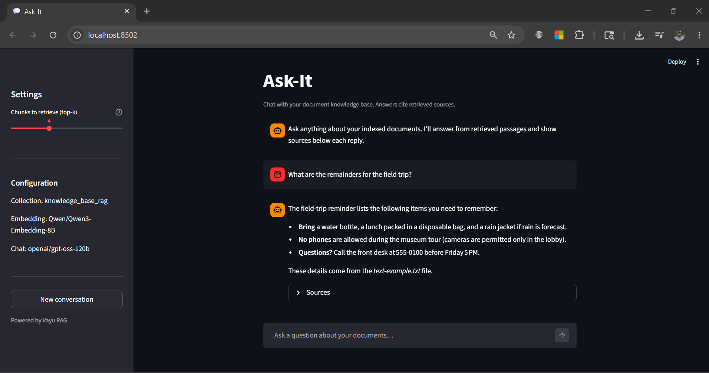

# 💬 Ask-It — Build a Document Chat Assistant on Vayu


**Ask-It** is a starter template that helps you build a chat assistant that answers questions from *your own* documents — and always shows which document the answer came from. You give it a folder of documents (manuals, policies, textbooks, notes), and users can ask questions in plain language and get trustworthy, sourced answers — including in Indian languages.

---

## 🎯 What you'll build

A working question-answering app, powered end to end by the **Vayu platform**:



The chat UI (`05_build_app/chat_app.py`) lets users ask questions, returns grounded answers, and shows expandable source citations for every reply.

---

## ⚙️ How it works (in plain English)

This project uses a technique called **RAG (Retrieval-Augmented Generation)**. Here is the whole idea in four steps:

1. **Store** your documents in cloud storage.
2. **Chunk & embed** them — split documents into small pieces and turn each piece into a list of numbers (an *embedding*) that captures its meaning.
3. **Search** — when a user asks a question, find the document pieces whose meaning is closest to the question.
4. **Answer** — hand those pieces to a language model (LLM) and ask it to write an answer, citing the sources.

```text
Your docs  →  Embed & index  →  User asks a question  →  Find relevant pieces  →  LLM writes a sourced answer
```

You do **not** need to be an AI expert to complete this. Each step tells you exactly what to click and run.

---

## 🗺️ Journey at a glance

Follow these in order. Each folder has its own README with detailed instructions.

| Step | Vayu service | Folder | Role in the stack | How you wire it up |
|:----:|--------------|--------|-------------------|--------------------|
| 0 | Vayu AI Studio Workspace | [`00_vayu_workspace/`](00_vayu_workspace/) | Compute environment for the notebooks and app | Create your workspace with Docker enabled and clone this repo |
| 1 | Vayu Object Storage | [`01_dataset/`](01_dataset/) | Data — your source documents | Upload your documents to a cloud bucket (optional; the local `docs/` folder also works) |
| 2 | Vayu Vector DB (Qdrant) | [`02_vayu_vector_databases/`](02_vayu_vector_databases/) | Retrieval — stores embeddings for meaning-based search | Create a Qdrant database, then copy `QDRANT_URL` and `QDRANT_API_KEY` into `.env` |
| 3 | Vayu Model as a Service | [`03_vayu_model_as_a_service/`](03_vayu_model_as_a_service/) | Models — one embedding model and one chat model (LLM) | Create two API keys, then set `OPENAI_BASE_URL`, `EMBEDDING_MODEL`, and `CHAT_MODEL` in `.env` |
| 4 | Vayu AI Studio (RAG lab) | [`04_starter_kit/`](04_starter_kit/) | Ingestion — chunk, embed, and index the docs | Run `qna.ipynb` to chunk, embed, and index your documents |
| 5 | Streamlit (local) | [`05_build_app/`](05_build_app/) | App — chat UI plus the RAG engine | Run `chat_app.py` locally and test with Top-K and Sources |
| 6 | Vayu ML Service | [`06_deploy/`](06_deploy/) | Hosting — the deployed container | Build, sign, and push the image, then deploy it as an ML Service |

> **Tip:** Steps 0–4 set things up. Step 5 is where you first *see it work*. Step 6 is optional but recommended if you want a shareable URL (e.g. for judges).

---

<details>
<summary><h3>🗂️ Project layout</h3></summary>

```text
ask-it/
├── README.md                     # You are here
├── requirements.txt              # Python dependencies
├── .env.example                  # Template — copy to .env and fill in your values
│
├── 00_vayu_workspace/            # Step 0 · Create a Vayu Workspace
├── 01_dataset/
│   ├── 01_dataset.ipynb          # Step 1 · Upload docs to Object Storage
│   └── docs/                     # Sample documents (.md, .txt, .html)
├── 02_vayu_vector_databases/     # Step 2 · Provision Vector DB (Qdrant)
├── 03_vayu_model_as_a_service/   # Step 3 · Get model API keys
├── 04_starter_kit/
│   └── qna.ipynb                 # Step 4 · Chunk → embed → index
├── 05_build_app/
│   ├── chat_app.py               # Step 5 · Streamlit chat UI (run locally)
│   ├── rag_client.py             # RAG engine (retrieve + prompt + citations)
│   ├── Dockerfile                # Step 6 · Image definition
│   └── README.md
└── 06_deploy/
    ├── README.md                 # Step 6 · Build, sign, push, deploy
    └── image-signing/            # Optional automated image signing
```

</details>

---

<details>
<summary><h3>🔐 Before you begin: the <code>.env</code> file</h3></summary>

Almost every step reads its settings from one file: **`ask-it/.env`**. You create it once (by copying `.env.example`) and fill in values as you complete each step. The notebooks and app load it automatically.

> **Never commit `.env` to git or share it** — it holds your secret keys.

Here is the full template. You will collect these values as you go through Steps 1–3 (and 6):

```bash
# Vayu Vector DB (Qdrant) — from Step 2
QDRANT_URL=<your-qdrant-url>
QDRANT_API_KEY=<your-qdrant-api-key>
COLLECTION_NAME=knowledge_base_rag

# Vayu Model as a Service — from Step 3
OPENAI_BASE_URL=<your-maas-base-url>
LLM_OPENAI_API_KEY=<your-maas-api-key>
EMBEDDING_OPENAI_API_KEY=<your-maas-api-key>
EMBEDDING_MODEL=<your-embedding-model>
CHAT_MODEL=<your-chat-model>

# Vayu Object Storage (optional) — from Step 1
VAYU_S3_KEY=<your-access-key>
VAYU_S3_SECRET=<your-secret-key>
VAYU_S3_ENDPOINT=<your-s3-endpoint>
VAYU_S3_BUCKET=<your-bucket-name>

# Vayu Container Registry — from Step 6 (build, sign, deploy)
# Host only — do not include https://, http://, or a trailing /
IMAGE_REGISTRY=<your-image-registry>
REGISTRY_PROJECT=<your-registry-project>
REGISTRY_USERNAME=<container-registry-username>
REGISTRY_PASSWORD=<container-registry-password>
VAYU_USERNAME=<your-vayu-username>
```

</details>

---

<details>
<summary><h3>🚀 Quick start (the short version)</h3></summary>

If you just want the overall shape before diving into each step:

1. **Set up** — Do [Step 0](00_vayu_workspace/) (create workspace, clone repo). Then, in the workspace terminal:

   ```bash
   git clone https://ailab.cloudservices.tatacommunications.com/code/vayu-hackathon/ask-it.git
   python3 -m venv .venv
   source .venv/bin/activate
   cd ask-it
   pip install -r requirements.txt
   cp .env.example .env      # then fill in values as you go
   ```

2. **Collect credentials** — Fill in `.env` using [Step 2](02_vayu_vector_databases/) (Vector DB) and [Step 3](03_vayu_model_as_a_service/) (models). Object Storage keys from [Step 1](01_dataset/) are optional.

3. **Ingest once** — Open `04_starter_kit/qna.ipynb` in Vayu AI Studio, pick the kernel, and run all cells:

   1. Open **Select Kernel** → **Python Environments**.

   

   2. Choose the **Recommended** environment (it should point to the `.venv` from [Step 0](00_vayu_workspace/)).

   

   3. Confirm the interpreter path ends with `<your-env-name>/bin/python` (e.g. `.venv/bin/python`).

   Full details in [Step 4](04_starter_kit/).

4. **Chat locally** — Run the app and open the URL it prints:

   ```bash
   cd 05_build_app
   streamlit run chat_app.py
   ```

   Open **http://localhost:8501** (or the Studio proxy URL, e.g. `https://<your-workspace-host>/proxy/8501`). Use the sidebar **Top-K** and expand **Sources** on each reply.

5. **Deploy (optional)** — Once local testing works, build, sign, and push the image in [Step 6](06_deploy/).

> `IMAGE_REGISTRY` must be the registry **hostname only** (e.g. `image-registry-....cloudservices.tatacommunications.com`) — no `https://`, `http://`, or trailing `/`.

</details>

---

<details>
<summary><h3>🔑 Environment variables reference</h3></summary>

| Variable | Required | Notes |
|----------|----------|--------|
| `QDRANT_URL` | Yes (hosted) | **Vayu Vector DB** endpoint from AI Studio |
| `QDRANT_API_KEY` | Yes (hosted) | **Vayu Vector DB** API key from AI Studio |
| `QDRANT_PATH` | Dev alternative | Local Qdrant only; omit `QDRANT_URL` |
| `LLM_OPENAI_API_KEY` | Yes | **Vayu Model as a Service** chat API key |
| `EMBEDDING_OPENAI_API_KEY` | Yes | **Vayu Model as a Service** embedding API key |
| `OPENAI_BASE_URL` | Yes | **Vayu Model as a Service** base URL |
| `EMBEDDING_MODEL` | Yes | Must match model used at ingest |
| `CHAT_MODEL` | Yes | Must match model used at ingest |
| `COLLECTION_NAME` | No | Default `knowledge_base_rag` |
| `VAYU_S3_KEY` | Step 1 only | Object Storage access key (optional) |
| `VAYU_S3_SECRET` | Step 1 only | Object Storage secret key (optional) |
| `VAYU_S3_ENDPOINT` | Step 1 only | Object Storage endpoint URL (optional) |
| `VAYU_S3_BUCKET` | Step 1 only | Object Storage bucket name (optional) |
| `IMAGE_REGISTRY` | Step 6 only | Container registry hostname (no `https://`) |
| `REGISTRY_PROJECT` | Step 6 only | Registry project name |
| `REGISTRY_USERNAME` | Step 6 only | `docker login` and image signing |
| `REGISTRY_PASSWORD` | Step 6 only | `docker login` and image signing |
| `VAYU_USERNAME` | Step 6 only | Certificate identity for `tcl-cosign verify` |

</details>

---

<details>
<summary><h3>💡 Tips for a great result</h3></summary>

- **Ingest before you chat** — The app only *queries*; run the notebook first so it has something to search.
- **Show your sources** — Grounded answers with citations are far more trustworthy than fluent guesses.
- **Keep models consistent** — If you change the embedding model, recreate the Vector DB collection (the vector size must match).
- **Watch your credits** — Use smaller chat models for dry runs; monitor usage in Vayu observability during a demo.
- **Need PDFs/DOCX?** — Add `pypdf` / `python-docx` loaders in the notebook (the starter handles `.md`, `.txt`, `.html`).

</details>

---

<details>
<summary><h3>📄 License</h3></summary>

Use and modify for the **Vayu Hackathon** submission unless your team repo specifies otherwise.

</details>
